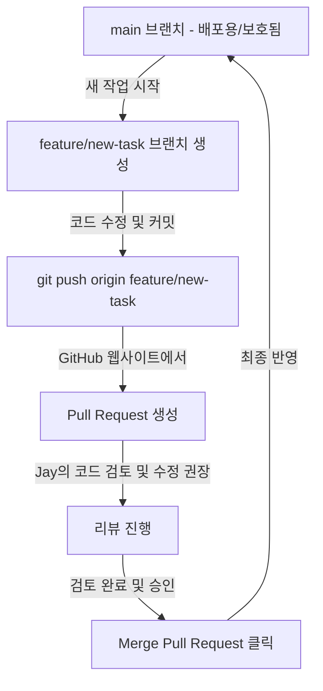

# 초보자를 위한 Git & GitHub 핵심 활용 가이드 🚀

안녕하세요, Jay! Git과 GitHub를 처음 시작하시는 분들을 위해 가장 쉽고, 현업에서 매일 사용하게 되는 핵심 실무 패턴들만 모아 완벽히 정리했습니다. 이 가이드를 곁에 두고 차근차근 따라 해보세요!

---

## 1. 새로운 프로젝트 생성 및 로컬-원격 동기화(Sync) 🔄

내 컴퓨터(로컬)에서 새로운 코딩 프로젝트를 시작하고, 이를 GitHub(원격)에 올려 동기화하는 가장 확실한 데일리 루틴입니다.

### 1단계: 내 프로젝트 폴더에서 Git 시작하기 (로컬)
원하는 프로젝트 폴더 안에서 아래 명령어를 실행하여 Git 저장소(.git)를 개설합니다.
```bash
# 1. 현재 폴더를 Git 저장소로 초기화
git init

# 2. 업로드할 파일들을 장바구니에 담기 (점은 '모든 파일'을 의미)
git add .

# 3. 첫 박스 포장 완료 (메시지는 영문 또는 한글로 간단히 적음)
git commit -m "First commit with project base"
```

### 2단계: GitHub에 올려서 첫 동기화하기 (원격 연동)
GitHub 웹사이트에서 새로운 Repository(예: `empsvc`)를 생성한 후, 화면에 나오는 주소를 복사해 연동합니다.
```bash
# 4. 내 로컬 폴더에 GitHub 원격 주소를 'origin'이라는 이름으로 등록
git remote add origin https://github.com/shinypsy/empsvc.git

# 5. 로컬 기본 브랜치 이름을 'main'으로 변경
git branch -M main

# 6. 내 코드를 GitHub(origin)의 main 브랜치로 첫 업로드
git push -u origin main
```
*💡 `-u origin main` 옵션은 처음 한 번만 써주면, 다음부터는 단순히 `git push` 또는 `git pull`만 쳐도 알아서 척척 연동됩니다.*

### 3단계: 매일 사용하는 데일리 동기화 루틴 (매우 중요!)
코드 수정이 끝났을 때 깃허브와 동기화하는 습관적인 **3단계 명령어**입니다.
```bash
# [작업 후 업로드]
git add .
git commit -m "수정한 작업 내용 간략히 작성"
git push

# [작업 전 다운로드] - 다른 곳에서 수정되었거나 협업 중일 때 최신본 받아오기
git pull
```

---

## 2. 브랜치(Branch) 협업 및 main 안전하게 지키기 (PR & Review) 🛡️

여러 명 또는 혼자서 작업하더라도 `main` 브랜치에 코드가 직접 들어가 망가지는 것을 막고, **대표(Jay)가 최종 검토 및 승인한 뒤에만 반영**되게 하는 최고의 협업 프로토콜입니다.



### 1단계: 새로운 기능 개발을 위한 브랜치 따기
`main` 브랜치는 항상 완성된 깨끗한 코드만 들어 있어야 하므로, 새로운 작업을 할 때는 무조건 **서브 브랜치**를 만들어서 들어갑니다.
```bash
# 1. 최신 코드를 pull로 먼저 동기화
git checkout main
git pull

# 2. 새로운 브랜치를 만들고 즉시 이동 (예: feature/update-data)
git checkout -b feature/update-data
```

### 2단계: 서브 브랜치에서 작업 후 GitHub에 업로드하기
새로 만들어진 독립 공간(`feature/update-data`)에서 코드를 마음껏 수정, 테스트한 뒤 커밋하여 업로드합니다.
```bash
# 3. 수정 사항 장바구니 담기 및 포장
git add .
git commit -m "양천구 건물명 매칭 작업 완료"

# 4. 내 서브 브랜치를 GitHub에 업로드
git push origin feature/update-data
```

### 3단계: Pull Request(PR) 생성 및 Jay의 최종 검토 (가장 핵심!)
1. GitHub 웹사이트 내의 `shinypsy/empsvc` 저장소로 접속합니다.
2. 상단에 노란색 띠와 함께 **`Compare & pull request`** 버튼이 활성화되어 있을 것입니다. 이를 클릭합니다.
3. 작업자가 무엇을 수정했는지 한글로 상세히 적고 **`Create pull request`**를 누릅니다.
4. **[검토자 Jay의 역할]**:
   - Jay는 생성된 PR의 `Files changed` 탭에서 어떤 코드 라인이 추가되거나 삭제되었는지 눈으로 꼼꼼하게 검토할 수 있습니다.
   - 특정 라인에 마우스를 대고 **댓글(Comment)**을 남겨 수정을 요청할 수도 있습니다.
   - 검토 결과 완벽하다고 판단되면, PR 하단의 녹색 버튼 **`Merge pull request`** -> **`Confirm merge`**를 클릭합니다.
   - 이 순간에 비로소 서브 브랜치의 작업 내용이 대표 `main` 브랜치에 안전하게 합쳐집니다!

---

## 3. 매일 쓰는 유용한 Git 명령어 치트 시트 📝

이것만 외워두거나 복사해서 메모장에 붙여놓으면 Git 초보를 탈출할 수 있습니다!

| 명령어 | 용도 | 설명 |
| :--- | :--- | :--- |
| `git status` | 상태 확인 | 장바구니에 담긴 파일과 수정된 파일 리스트를 실시간 확인 |
| `git log --oneline` | 커밋 내역 | 여태까지 포장(Commit)했던 히스토리를 1줄씩 간결하게 조회 |
| `git diff` | 코드 대조 | 마지막 커밋 대비 어떤 소스코드가 수정되었는지 상세 비교 |
| `git checkout main` | 메인 이동 | 완성 본인 main 브랜치로 즉시 작업 공간을 전환 |
| `git branch -a` | 브랜치 목록 | 내 컴퓨터와 원격 깃허브에 개설된 모든 브랜치 조회 |
| `git restore <파일명>` | 작업 취소 | 아직 커밋하지 않은 소스코드 수정을 전격 초기화하고 되돌림 |
